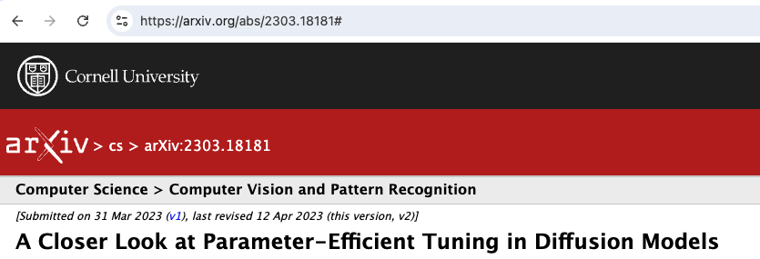
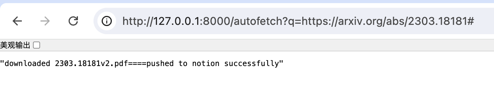
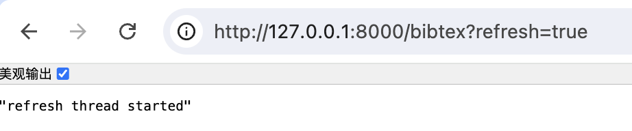
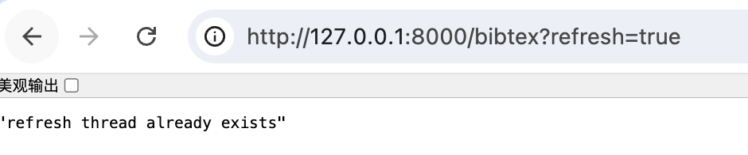

# arxiv auto workflow

This is a automatic workflow for manage arxiv papers with notion.

if you like this project, please give me a star✨!

## background & motivation

- **arxiv becomes a popular** platform for sharing scientific papers, as a AI researcher, I get papers almost from arxiv
- there is no efficient way to manage papers for files, citations, notes, and other information. **[Endnote](https://endnote.com/)** manage citations mainly, **[Readpaper](https://readpaper.com/home/)** dones a good job for notes, files and inplace translations, but lacks of self-defined field and efficient search.
- some paper release with arxiv, but soon will be accepted by a conference or journal,**how to update the bibtex and other information** if you want to cite it in your paper?
- my solution is to build a **visualized database for papers via notion**, define my field and tags for papers, and use `Readpaper` to read them.

The problem is:
when getting an interesting title of a new paper, I may do:
 
- opening url to search
- create a new page in **notion**
- copy and paste title, abstract, and other information manually
- manually download pdf and store to local directory
  
it is very time-consuming and error-prone.


## solution and features
My solution is to build up a workflow，drop title or arxiv id，program will automatically search arxiv and get the paper information, 
then create a new page in notion with the information，
and also download the pdf file and store it to local directory.
### 1. search arxiv and get paper information
when find a paper in abs/pdf url, just modify url using predefined api, then your auto workflow will be launched:
| before | after |
| --- | --- |
|   |  |
files will be downloaded, metainfos will be uploaded to notion!

### 2. auto bibtex refresh
refresh bibtex by [semanticscholar api](https://www.semanticscholar.org/product/api), and update the bibtex field in notion.
As there are rate limit for semanticscholar api, we choose to start a new thread in background to refresh bibtex with a long sleep interval.
| start refresh | check refresh |
| --- | --- |
|   |  |
check `fetch.log` to see if refresh is successful.

## how to use

### prepare notion database and notion token
1. refer to my released [notion template](https://thorn-nymphea-be8.notion.site/5949a9924cc546799804a42ca4917d81), and add to your workspace.
2. get the database id accroding to [notion doc](https://developers.notion.com/reference/retrieve-a-database)
3. get the notion access token according to [notion doc](https://developers.notion.com/docs/getting-started#step-1-create-an-integration)
4. test the notion api with `curl` command:
   
```bash
curl -X GET https://api.notion.com/v1/databases/{database_id} \
  -H "Authorization: Bearer {token}" \
  -H "Notion-Version: 2021-08-16"
```

### from source code
```bash
pip install -r requirements.txt
export NOTION_TOKEN=<your_notion_token>
export NOTION_DATABASE_ID=<your_notion_database_id>
export DOWNLOAD_DIR=<your_download_directory>
fastapi run server.py
```

### using docker
```bash
docker build -t arxiv-workflow .

export NOTION_TOKEN=<your_notion_token>
export NOTION_DATABASE_ID=<your_notion_database_id>
export DOWNLOAD_DIR=<your_download_directory>

docker run -it --rm -e NOTION_TOKEN=$NOTION_TOKEN \
    -e NOTION_DATABASE_ID=$NOTION_DATABASE_ID \
    -e DOWNLOAD_DIR=/download \
    -v $DOWNLOAD_DIR:/download \
    -p 8000:8000 \
    arxiv-workflow
```

## TODOs

- [x] release my notion database template
- [x] bibtex auto refresh
- [x] export bibtex file for all your papers,
- [ ] support export bibtex file for specific paper with alias you've added
- [ ] rest API documentation and CLI tools if needed
- [ ] if system becomes complex, add config system

